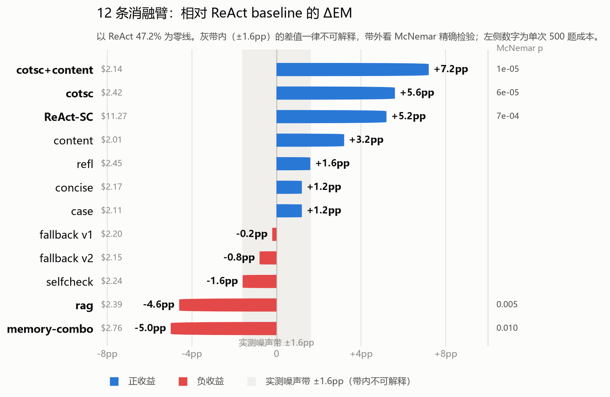

# ReAct on HotpotQA (fullwiki)：复现、分层改进与消融方法论

离线复现 ReAct agent（HotpotQA fullwiki 设定），并用**分层消融 + 实测噪声底线**的方法论做改进：
**EM 47.2% → 54.4%（+7.2pp，McNemar p=1.4e-5），held-out 复现 +5.8pp（p=2e-4），单题成本零增加。**

- 策略层改进：步数耗尽时回退 CoT 自洽投票（ReAct→CoT-SC，论文最佳组合）
- 工具层改进：标题检索 miss 时回退全文 BM25 内容检索（DrQA 式）
- 方法论：实测 temp=0 噪声底线 ±1.6pp + 配对 McNemar 判显著性；11 条消融臂中 6 条判为噪声、2 条显著为负、1 条边缘显著（content，p=0.052），显著为正的只有 cotsc（p=6e-5）与 ReAct-SC（p=7e-4）两条；最终采纳的是 cotsc + content 组合（ReAct-SC 收益相当但成本 5×、ROI 不成立）

## 结果速览

**四个 baseline（500 题，seed-233 调参集，deepseek-v4-flash，temp=0）**

| 方法 | EM | F1 | 成本 | 备注 |
|---|---|---|---|---|
| Direct（闭卷） | 31.2% | 42.5% | $0.05 | comparison 题贡献虚高 |
| CoT | 40.8% | 55.1% | $0.16 | |
| Act-only | 30.0% | 37.4% | $1.22 | 无 Thought 的消融对照 |
| **ReAct** | **47.2%** | **59.0%** | $2.14 | avg 4.6 步，25% 步数耗尽 |

**消融全表（同 500 题配对，McNemar vs ReAct baseline）**

| 层 | 臂 | EM | ΔEM | 显著性 | 结论 |
|---|---|---|---|---|---|
| 工具 | rag（BM25 选句观测） | 42.6% | -4.6pp | p<0.05 | 显著负：导语前 5 句即最优观测 |
| 策略 | case memory | 48.4% | +1.2pp | n.s. | 噪声 |
| 策略 | reflection memory | 48.8% | +1.6pp | n.s. | 噪声 |
| 混合 | rag+case+refl | 42.2% | -5.0pp | p<0.05 | rag 伤害主导 |
| 工具 | fallback v1（砍尾词重试） | 47.0% | -0.2pp | p=1.0 | 救回的是名字索引页 |
| 策略 | concise（粒度约束 prompt） | 48.4% | +1.2pp | n.s. | 近似错 34→28，方向对量太小 |
| 策略 | selfcheck（yes/no 验证门） | 45.6% | -1.6pp | n.s. | 门只触发 2/500，从未真正工作 |
| 工具 | fallback v2（FTS 标题候选） | 46.4% | -0.8pp | n.s. | 噪声 |
| **工具** | **content（全文 BM25 兜底）** | **50.4%** | **+3.2pp** | p=0.052 | ff 25%→18%，成本反降 |
| **策略** | **React + cotsc（耗尽时 CoT 投票）** | **52.8%** | **+5.6pp** | **p=6e-5** | 成本仅 +$0.3 ⓐ |
| 策略 | ReAct-SC（5 轨迹投票） | 52.4% | +5.2pp | p=7e-4 | 同等收益但成本 5×（$11.3） |
| **组合** | **React + cotsc + content** | **54.4%** | **+7.2pp** | **p=1.4e-5** | **成本与 baseline 持平** |

> ⓐ cotsc 一行跨两次同配置复跑引用：**EM 52.8% / p=6e-5** 取自 `react_n500_seed233_off0_cotsc2_20260909_111248`；**成本 +$0.3（$2.42）** 取自 `react_n500_seed233_off0_cotsc_20260909_110401`（EM 52.4%）。cotsc2 的 summary 存在 token 计数漏记（`llm.calls=181` ↔ `avg_llm_calls=5.97`），其成本字段 $0.15 不可用，故成本口径以 110401 为准。

> **±1.6pp 噪声底线怎么来的**：temp=0 下 DeepSeek 并非逐位确定。selfcheck 臂的验证门在 500 题里只否决过 2 次，即其余 **498 题与 baseline 行为完全相同**（prompt/动作序列一致），可当纯噪声对照：这 498 题中 **82 题预测改变、42 题 EM 翻转（25 题对→错、17 题错→对）**，净 **-1.6pp**；按全 500 题统计，**423 题（84.6%）轨迹分叉、84 题预测改变**。故本文以 |ΔEM| < ~2pp 判噪声，并以配对 McNemar 精确检验佐证。





**held-out 验证（off500，从未调参的 500 题）**

| | baseline | React + cotsc + content | Δ |
|---|---|---|---|
| held-out | 45.8% | 51.6% | **+5.8pp，p=2e-4** |

## 两个改进臂的实现

**cotsc（策略层）**：ReAct 原论文的最佳组合（ReAct→CoT-SC，PaLM 时代 +7.7pp）的按需版。步数耗尽（25% 的题）时，采样 5 条 CoT（temp=0.7），用官方 `normalize_answer` 分组多数投票，以胜出答案 finish。只在被迫结束时触发 → 成本 +$0.3，而同等工作量的无差别轨迹投票（ReAct-SC）要 $11.3。

**content（工具层）**：ReAct 的 `search[entity]` 只做维基**标题精确匹配**——58% 的 baseline 失败（154/264）trace 中至少出现过一次标题 miss，是失败的首要关联信号（多数靠后续检索自行恢复，并非全部直接死因）。本臂在标题 miss 时退回**内容级检索**：对 548 万页面中取得有效首段的 545 万页建 FTS5 索引（`data/wiki_content.db`，2.7GB），BM25 排序、全词 AND 匹配、逐次砍尾部限定词重试。离线验证：599 条 baseline miss query 救回 542 条，24% 救回页含 gold 答案（含直接命中答案页的案例）。

## 典型 trace 对照

同一题："Who directed the film about the living funeral for Morrie Schwartz?"（gold: Mick Jackson）

```
BASELINE（EM=0，空答案）                        COMBO（EM=1）
Action 4: Search[Morrie Schwartz living        Action 5: Search[Tuesdays with Morrie 1999 film director]
  funeral documentary]                           Observation 5: [content-match: Tuesdays with Morrie (film)] …
Observation 4: Could not find …                …（content 兜底把检索接回正确页面群）
…（连续 4 次标题 miss，步数耗尽）              [CoT-SC fallback: votes=['Mick Jackson']×5 -> Mick Jackson]
→ finish[] 空答案                              → finish[Mick Jackson] ✓
```

## 失败归因（每阶段 50 条失败精读，互斥归类）

| 类别 | baseline | content | cotsc2 | React + cotsc2 + content |
|---|---|---|---|---|
| A 粒度/格式（语义对但 EM 判错） | 34% | 40% | 44% | 42% |
| B 检索未达 | 24% | 28% | 20% | 26% |
| C 二跳断链 | 10% | 6% | 12% | 4% |
| D 歧义/错页滞留 | 8% | 6% | 4% | 4% |
| E 推理/证据误用 | 22% | 14% | 16% | 14% |
| F 标签/数据问题 | 2% | 2% | 2% | 10% |
（剩余极少的归类为“其他”）

残余失败高度集中：A 粒度桶（归一化层结构性问题，prompt 治不了）+ B 不可救检索（题干拼写错/前提错/2017 dump 页面缺失）+ F 标签噪声（≈10% → EM 天花板 ≈94-95%）。

## 复现

```bash
# 数据：官方 hotpot_dev_fullwiki_v1.json（7405 题；仓库内已转为
#      data/hotpotqa_fullwiki_dev.parquet，--data 默认指向它）
#      + ReAct 官方 wiki dump（enwiki-20171001）
.venv/Scripts/python scripts/build_wiki_index.py --src <dump目录> --out data/wiki_full.db
.venv/Scripts/python scripts/build_content_index.py          # 内容级索引（content 臂用）
export DEEPSEEK_API_KEY=...                                   # 或写入 .env

# 注意 --tag 决定产物文件名，勿复用已有 tag：`combo` 已被第一轮
# memory 组合臂占用（rag+case+refl，EM 42.2%），最终系统用 `cotsccontent`
.venv/Scripts/python src/run_eval.py --method react --n 500 --workers 16          # baseline
.venv/Scripts/python src/run_eval.py --method react --n 500 --workers 16 \
    --cotsc --env content --tag cotsccontent                                     # 最终系统
.venv/Scripts/python src/run_eval.py --method react --n 500 --offset 500 \
    --workers 16 --tag heldout-base                                              # held-out baseline
.venv/Scripts/python src/run_eval.py --method react --n 500 --offset 500 \
    --workers 16 --cotsc --env content --tag heldout-cotsccontent                # held-out 最终系统
```

本文引用的产物在 `results/`，按 tag 对应：最终系统 `cotsccontent`（[cotsccontent_20260909_152240](results/)，EM 54.4%）；held-out 两次共用 `heldout` tag，需按时间戳区分——`..._155938` 是 baseline（45.8%）、`..._160247` 是 cotsc+content（51.6%）。

评测只走 `src/hotpot_evaluate_v1.py` 官方 normalize/EM/F1；抽样 `random.Random(233).shuffle(range(7405))`，调参集 `[0:500]`、held-out `[500:1000]`。

## 结构

- `src/agents.py` agent 类层级（BaseAgent → Direct/CoT/ReAct → 12 个 ReAct 系子类，含 SelfCheckStrict、CotScContent 两个二阶子类；消融表 11 行映射到其中 9 个）
- `src/wiki_env.py` 离线 WikiEnv（观测格式对齐官方 wikienv.py）
- `src/retrievers.py` 工具层 env：RAG 选句 / fallback v1,v2 / content 全文兜底
- `src/memory.py` 记忆层（BM25 + case/reflection banks，内置 stdlib 实现）
- `src/run_eval.py` 评测 CLI（--env/--prompt/--selfcheck/--cotsc/--sc/--resume）
- `scripts/` 索引构建、记忆挖掘、trace 回放（replay_trace.py --diff 做改进前后对照）
- `results/` 全部 run 的 jsonl + summary；`results/failure_attribution.json` 失败归因数据

